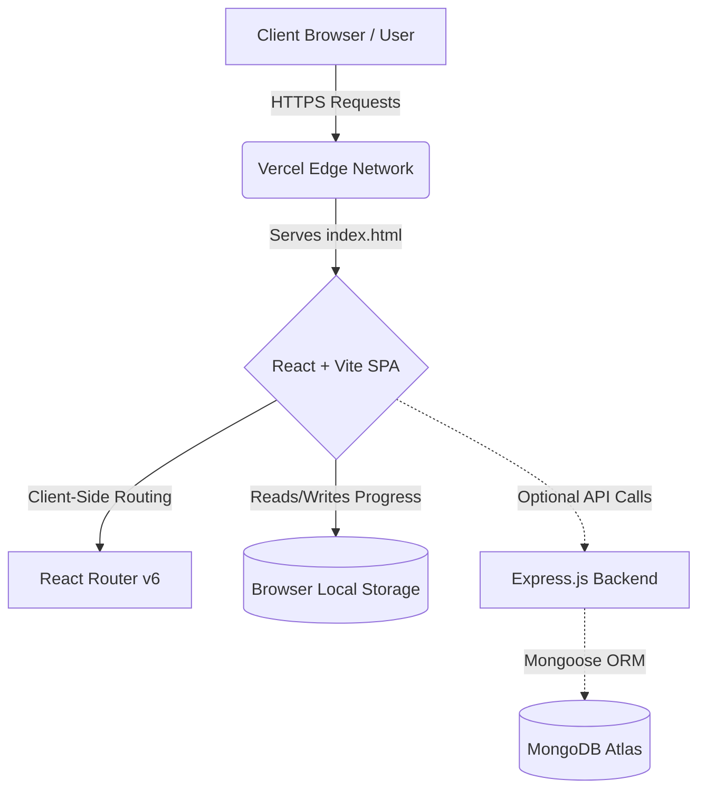

# 🏗️ System Architecture

The CosmicVerse is designed as a decoupled full-stack application, utilizing the MERN stack (MongoDB, Express, React, Node.js). While it currently runs beautifully as a frontend-only SPA in production, it is built with a modular backend architecture to support future scaling.

## 🗺️ High-Level Overview

## 🖥️ 1. Frontend Layer (Client)

The frontend is built to be lightning-fast, highly responsive, and completely independent of heavy CSS frameworks.

- **Framework**: React 18 + Vite. We chose Vite over Create React App (CRA) for its sub-second Hot Module Replacement (HMR) and optimized rollup builds.
- **Routing**: `react-router-dom` v6 handles all curriculum navigation natively within the browser, meaning page transitions happen instantly without server round-trips.
- **State Management**: Complex progress tracking is calculated algorithmically using React Hooks (`useState`, `useEffect`) and persisted in the user's browser, eliminating the need for mandatory database calls.
- **Styling Architecture**: Completely custom CSS. We utilize CSS Variables (`:root`) for instant dark/light mode toggling, and modern Flexbox/Grid for fluid typography and layouts.

## ⚙️ 2. Backend Layer (Server)

The backend is built as a RESTful API service. Even though the production app currently runs without it, the architecture is fully implemented.

- **Runtime**: Node.js
- **Framework**: Express.js
- **Routing**: Modular route handlers separated by resource (`/api/progress`, `/api/users`).
- **Security**: Built-in support for CORS and environment variables (`dotenv`) to ensure database credentials are never exposed to the client.

## 🗄️ 3. Database Layer

- **Database**: MongoDB (hosted on MongoDB Atlas)
- **ODM**: Mongoose
- **Schemas**: Strongly typed Mongoose models ensure data integrity before anything is written to the database.

## 🚀 4. Deployment Strategy

- **Frontend**: Deployed globally on **Vercel**. We utilize a custom `vercel.json` file to implement URL rewrites. This intercepts direct traffic to subpages (like `/learn/react`) and routes it back to `index.html` to prevent 404 errors, seamlessly handing control back to React Router.
- **DNS**: Handled via custom Anycast routing to provide the lowest latency possible globally.
